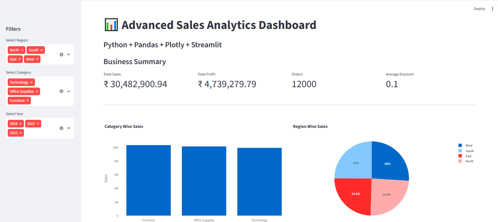
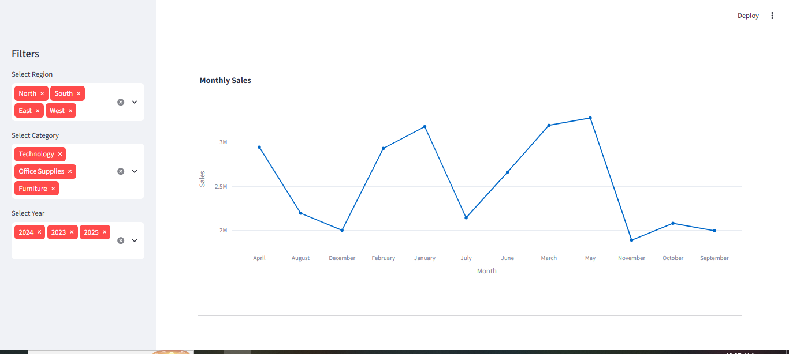
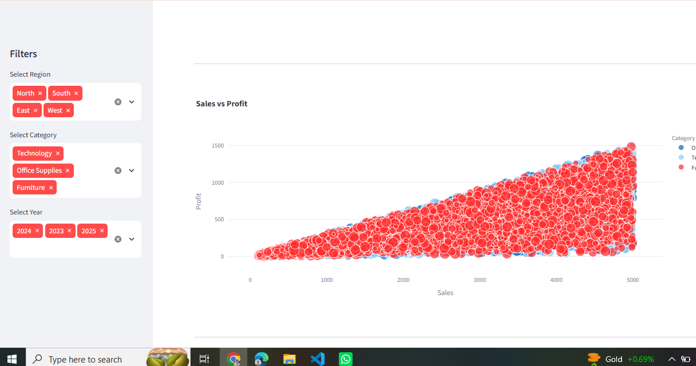
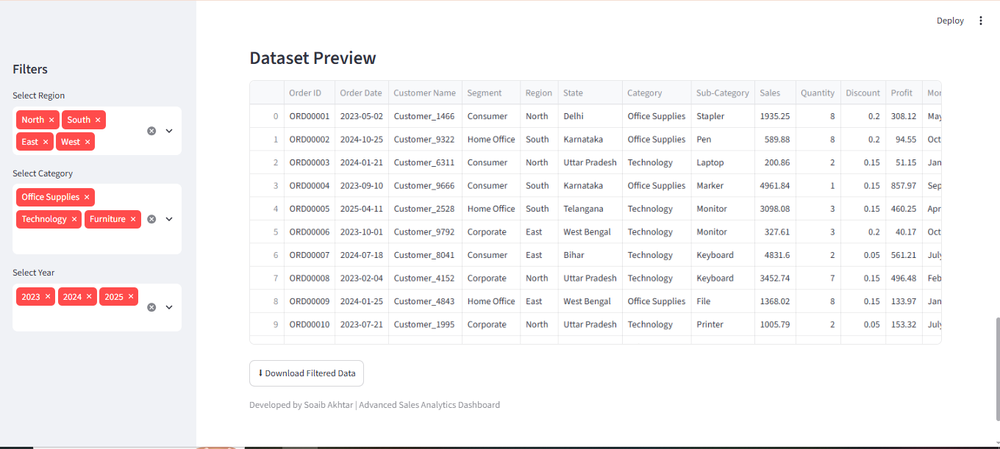

# 📊 Advanced Sales Data Analytics Dashboard

## Project Overview

## 📸 Dashboard Preview

### 📊 Dashboard Overview

### 📈 Sales Analytics

### 📋 Detailed Analysis

### Dataset Priview

The Advanced Sales Data Analytics Dashboard is a professional Data Analytics project developed using Python, Pandas, Plotly, and Streamlit.

This project performs data cleaning, exploratory data analysis (EDA), business analysis, and interactive dashboard visualization using a Superstore Sales Dataset.

---

## Features

- Data Cleaning
- Exploratory Data Analysis (EDA)
- Business Analysis
- Interactive Dashboard
- KPI Cards
- Category-wise Sales
- Region-wise Sales
- Monthly Sales Trend
- Sales vs Profit Analysis
- Top 10 Customers
- Top 10 Products
- Download Filtered Dataset

---

## Technologies Used

- Python
- Pandas
- NumPy
- Plotly
- Streamlit
- Matplotlib

---

## Dataset

Superstore Sales Dataset

Columns include:

- Order ID
- Order Date
- Customer Name
- Region
- State
- Category
- Sub-Category
- Sales
- Profit
- Quantity
- Discount

---

## How to Run

Install Requirements

pip install -r requirements.txt

Run Project

streamlit run app.py

---

## Developer

Soaib Akhtar

B.Tech CSE

Advanced Sales Analytics Dashboard
